# Git og Github Grundvallar hlutir

Ég ætla gera tilraun til þess að gera stuttar og laggóðar leiðbeiningar sem sýnir það minnsta sem þið þurfið að kunna til að koma verkefninu ykkar upp. Ég hvet ykkur til þess að leggja tíma í að lesa Git bókina sem er partur af lesefninu. Í hið minnsta bookmarkið bókina, og skoðið hans betur seinna í námsferlinum ykkar.

**Í lokin sýni ég ykkur þæginlegustu leiðina að mínu mati til að sækja og vinna með verkefnin úr þessum áfanga. Þið gerið það með því að Fork-a**

## Github

### Stofna Github Aðgang

Til að stofna aðgang á github farið þið einfaldlega inn á [Github](https://github.com/) og veljið `"Sign up"` uppi í hægra horninu.

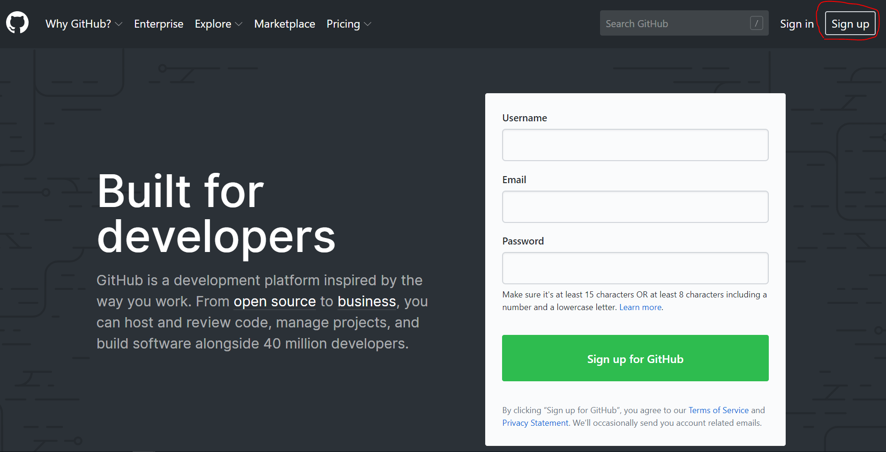

Síðan er fyllt inn upplýsingar um hvað Github notendanafnið ykkar eigi að vera, hvaða veffang er tengt við aðganginn ykkar og hvað lykilorðið ykkar þarf að vera. *Síðan þurfið þið að spila einhvern leik til þess að geta haldið áfram. Snúið dýrinu rétt, og ýtið á done.* Síðan ýtið þið á `"Next: Select a plan"`

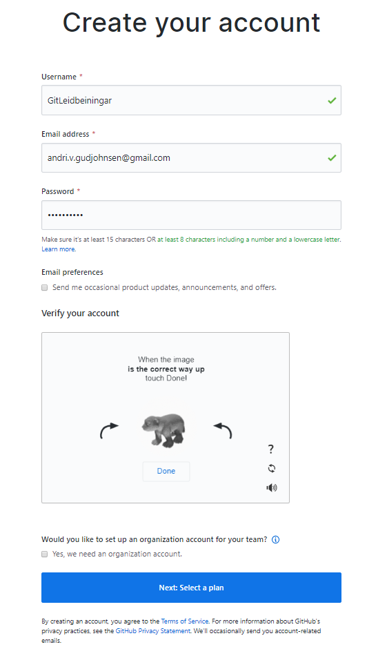

Þið getið bara valið ókeypis planið :)


Þið fáið staðfestingar póst sendann á veffangið sem þið tengduð við Github. Þið þurfið að staðfesta aðganginn ykkar áður en þið fáið að gera hluti. Svo klárið þaða ferli.

### Búa til Repository á Github (Að forka verkefnin er auðveldara)

Hér fyrir neðan sjáum við Forsíðuna á okkar Github síðu. Við skulum velja `Repositories`. Ég var ekki reiður þegar ég var að undirstrika Repositories, heldur var ég bara að reyna gera það augljóst.

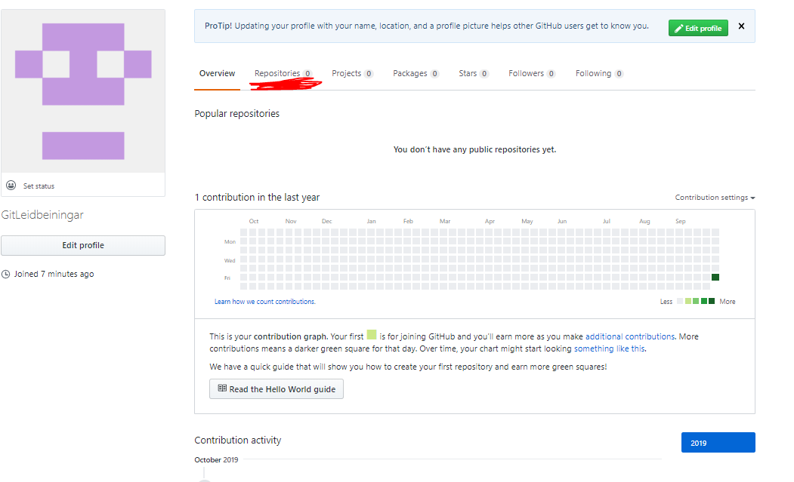

Þegar við erum komin á repositories síðuna getum við valið að búa til nýtt repository með því að velja `New`.

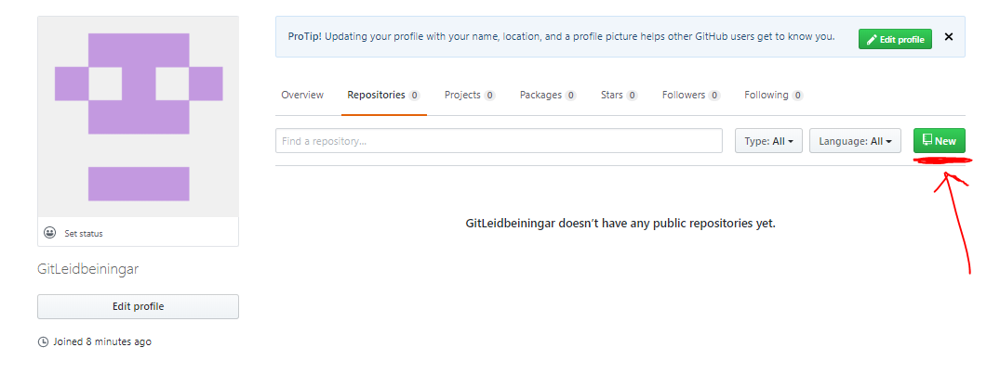

Við veljum eitthvað nafn fyrir repo-ið okkar. Ég valdi `leidbeiningar`, þótt `supreme-enigma` er svosem alveg ágætt nafn líka fyrir repo eins og github mælir með...... Ég mæli samt með að fyrir þennann áfanga reynið þið að vera með lýsandi repo nöfn.

Við getum haft repo-ið public eða private. Í þessum áfanga væri best ef þið hefðuð repo-ið ykkar public. :).

Svo ýtum við á `Create repository`.

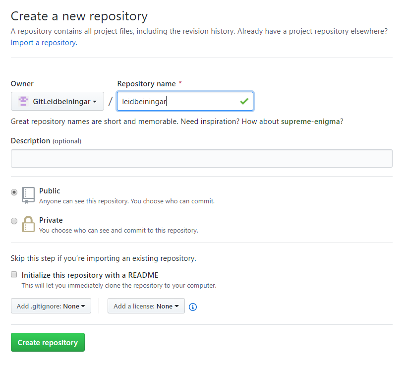

Þá erum við komin með tómt repository inná Github, og endum á síðu sem endar einhvernveginn svona

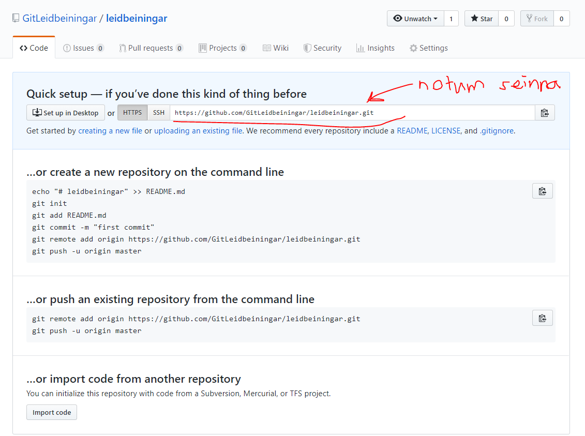

Næst skulum við skoða hvernig við getum Fært hluti í repo-ið okkar. Við getum fylgt leiðbeiningunum sem Git sýnir þarna. En það er til styttri leið sem ég ætla að sýna ykkur.  

## Git

Ég ætla ekki að Sýna ykkur hvernig þið setjið upp git í þessum leiðbeiningum. Ég hef trú að þið getið installað því. Í windows er nóg að gera next next next next install svo að allt virki. [Download Git.](https://git-scm.com/download/)

### Sækjum Repo-ið

Eftir að við höfum installað git á tölvuna okkar þá skulum við opna command line (Ég nota powershell sjálfur, en þetta ætti að vera sambærilegt allstaðar). Við byrjum á klón verkefnið okkar sem við gerðum hér fyrir ofan. Þannig ég byrja á að fara í möppuna sem ég vil klóna repo-ið mitt inní

```sh
 cd Skóli-2019
 cd GitLeiðbeiningar
 ```
Þegar við erum á réttum stað skrifum við inn
```sh
 git clone https://github.com/GitLeidbeiningar/leidbeiningar.git
 ```

Þá erum við komin með nýja möppu sem heitir leidbeiningar. Mappan heitir það sama og repo-ið heitir sem ég bjó til og klónaði, svo hún mun auðvitað heita eitthvað annað í ykkar tilfelli.... eins og til dæmis `supreme-enigma` eða `Verkefni 6`.


### Bætum við skrám og pushum.

Inní þessari möppu ætla ég núna að búa til leiðbeiningar fyrir github. Ég tók nokkrar myndir og skrifaði markdown skjal og þá lítur mappan mín svona út:

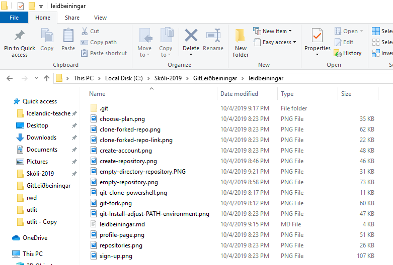

Núna fer ég aftur í command line og prófa að skrifa git status. Ég nota `git status` oft til að sjá hvað er ástandið er á git repo-inu.

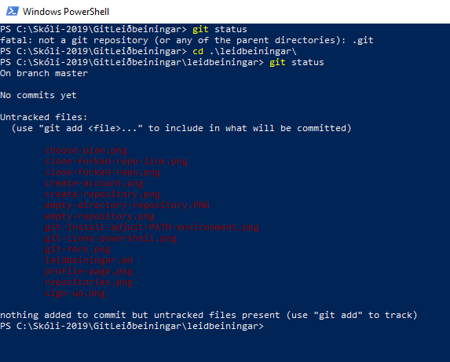

Núna sjáum við allar skrárnar okkar rauðar. Þær eru Untracked. Eins og stendur getum við notað `git add` til þess að þær verði með næst þegar við gerum `git commit`. Skrifum inn:

```sh
 git add .
 git status
 ```

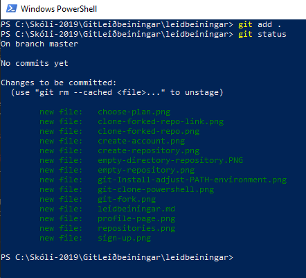

Núna sjáum við allar skrárnar okkar grænar. Þær verða allar með næst þegar við gerum `git commit`. Við skulum gera það.

```sh
 git commit -m "first commit"
 ```

 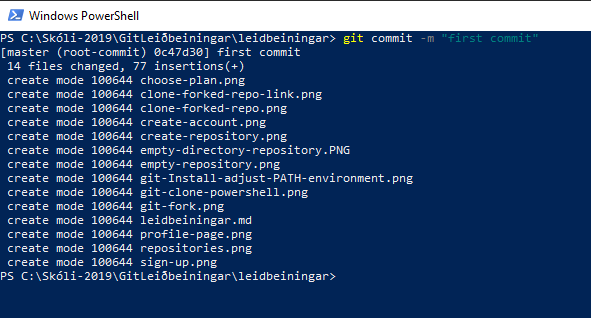

 Núna höfum við committað öllum skránum okkar, og commit skilaboðin eru "first commit". Núna erum við búin að taka snapshot af því hvernig mappan lítur út akkurat núna, og við getum hvenær sem er farið til baka og séð möppuna eins og hún er núna.

 Til þess að færa það sem við committuðum í github getum við gert

 ```sh
 git push origin master
 ```

 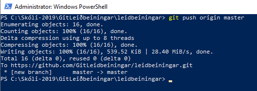

 Þið verðið kannski spurð um að skrifa inn notendanafnið ykkar og password.

 Núna sjáum við að allar skrárnar okkar eru komnar inná github

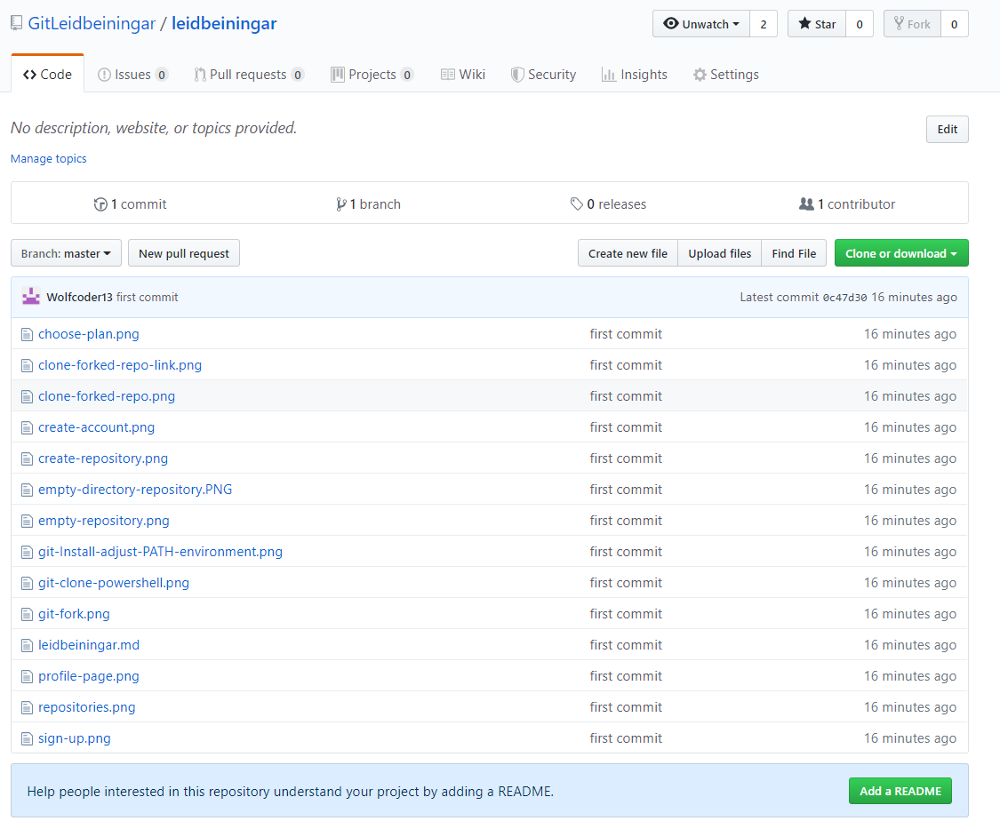

### Breytum skrám og pushum

Núna ætla ég að breyta skránni `leidbeiningar.md` ásamt því að bæta við nýjum myndum og færa nýjustu breytingarnar upp á github. Eftir að hafa breytt skránni mun ég gera eftirfarandi.

```sh
git add .
git commit -m "added more instructions to leidbeiningar.md"
git push origin master
```

Við sjáum að þetta eru "Galdraskipanirnar" þrjár sem þið munið nota mjög oft. `git add`, `git commit` og `git push`. Ég nota `git status` oft á milli þessara skipanna til að sjá hvort allt sé ekki með feldu.

Þá lítur github síðan okkar svona út


## Auðvelda leiðin fyrir einstaklings verkefnin.

Farið á github síðuna mína með verkefninu og forkið

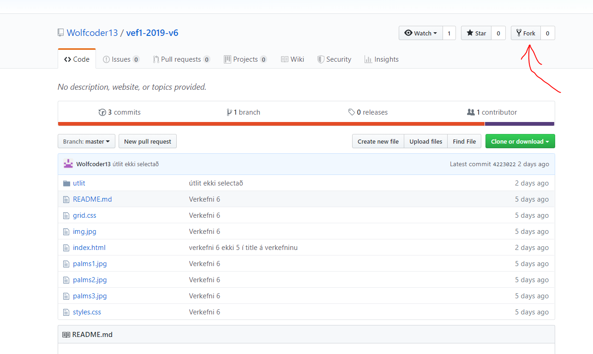

Þá eruð þið komið með afrit af repository-inu á ykkar github síðu sem þið geti breytt að vild.

Afritið git hlekkinn og klónið verkefnið á tölvuna ykkar


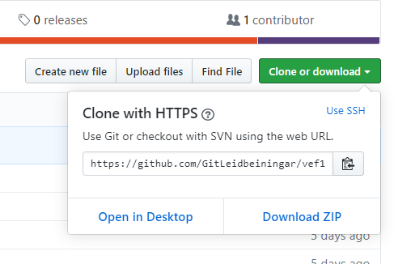

```sh
git clone https://github.com/GitLeidbeiningar/leidbeiningar.git
```

Getið breytt því sem þið viljið og notað galdraskipanirnar þrjár til að pusha breytingunum upp á Github repo-ið ykkar.

```sh
git add .
git commit -m "Finished the project, Web programming is so much fun wow"
git push origin master
```

En ef þið forkið verkefnið þá sjáið þið mín commits líka þegar þið gerið `git log`. En kannski breytir það engu fyrir ykkur :)

## Git Framhald
git er svo miklu meira, og þið munið einhverntíman þurfa læra almennilega á Git. Svo ég vil bara ítreka það að kaflarnir eru mjög góðir sem er hluti af námsefninu. Eftir ár eða hálft getur verið mjög gott að skoða aftur þessa kafla þegar þið hafi náð betri tökum á öllum grundvallar hlutunum í náminu.

Vonandi hjálpa þessar leiðbeiningar einhverjum :).